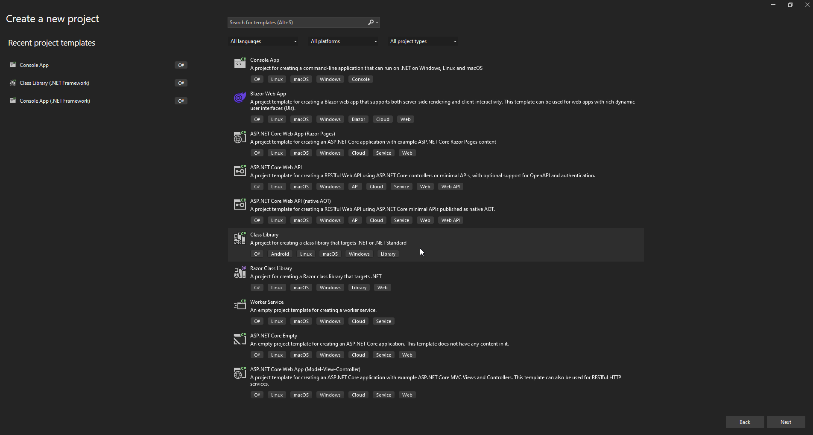
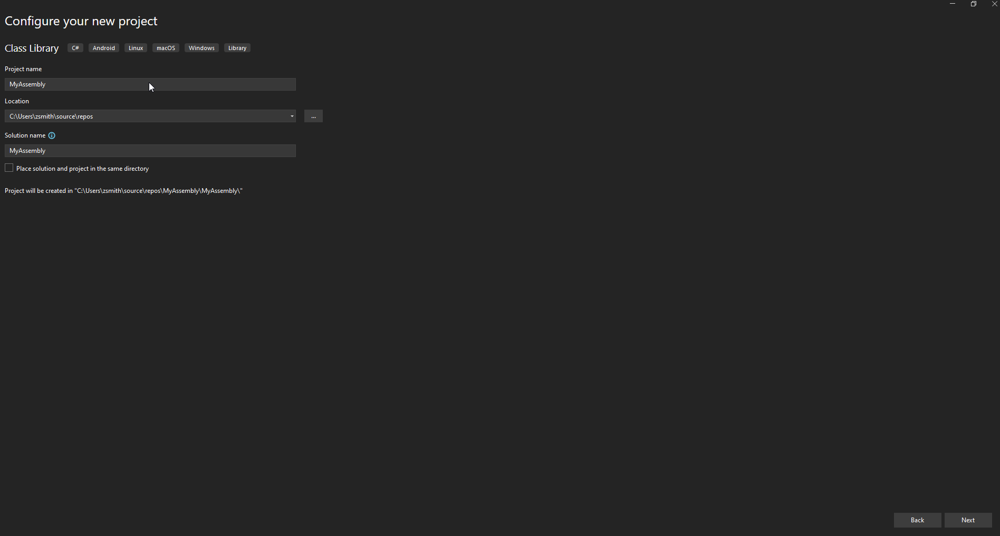
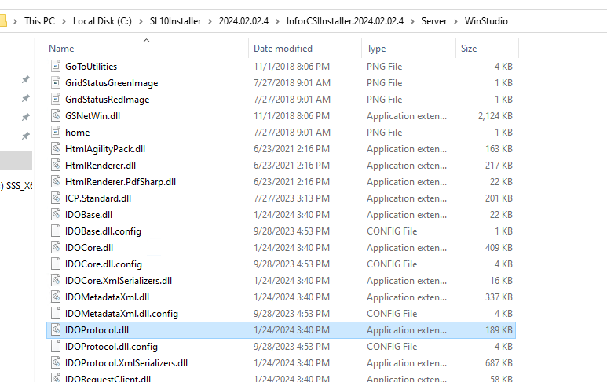
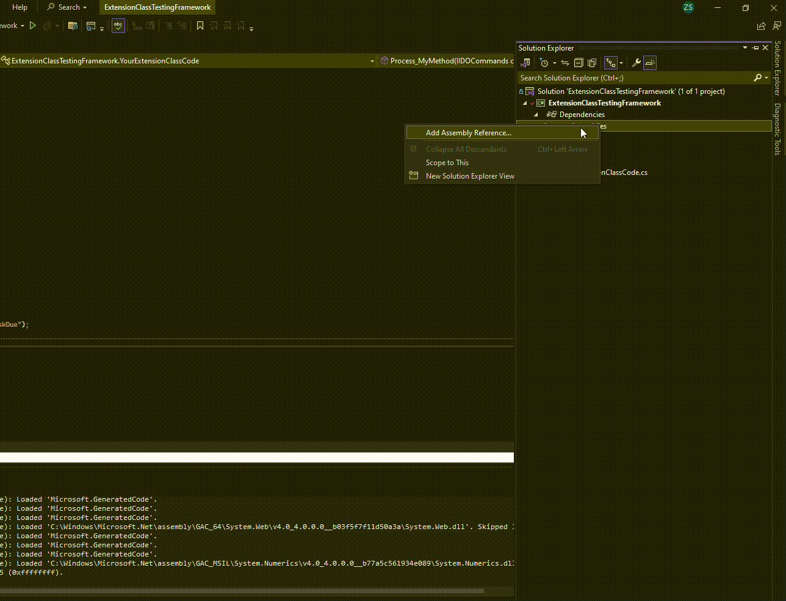
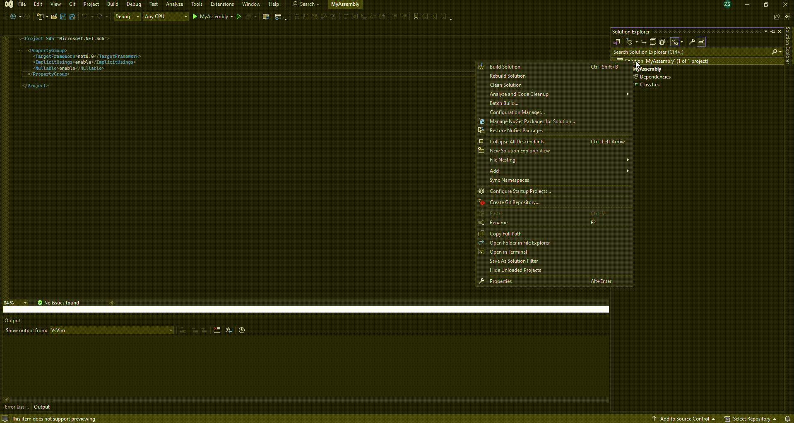

# Custom Assembly Reference Guide

The purpose of this repository is to provide a guide and reference for developing Infor Syteline Custom Assemblies/IDO Extension Classes.
This includes both instructional markdown documents as well as C# utility classes that you can use while developing Custom Assemblies.

# Class/Interface Reference

Find a quick reference guide for relevant Classes/Interfaces/Methods [here]('./reference.md')

# Quick Start

1. Create an empty C# project (Class Library) in Visual Studio



2. Import the SyteLine DLLs
In order to access Mongoose/SyteLine code, we must import it. There are 8 DLLs that must be imported:
- IDOCore.dll 
- IDOProtocol.dll 
- IDORequestClient.dll 
- MGScriptMgr.dll 
- MGShared.dll 
- MGSharedResources.dll 
- WSEnums.dll 
- WSFormServerProtocol.dll 

These DLLs can be found on the utility server in:
``sh
<InstallerDirectory>/<DatedFolder>/Server/WinStudio/
```




3. Set Up A Testing Console App
Create a new C# console app in the same solution. Import those same DLLs to the console app, if they are not there already. You will use this console app to test your assembly outside of the Syteline Frontend.

 

4. In the class library, extend the IDOExtensionClass like so: 
```csharp
    [IDOExtensionClass("CNH_DevelopmentTasks")]
    public class CNH_DevelopmentTaskAssembly : IDOExtensionClass
    {
        
    }
```

4. Create the Static Methods
These methods contain the actual "work" that the Custom Assembly does. Since we make 
these static, we can access them without instantiating the whole Mongoose infrastructure.

5. Link the Static Methods into the non-static methods with decorators
These are the methods that Syteline will call. Simply pass the base.Context to the static method as well as any parameters.

```csharp
        /// <summary>
        /// SyteLine uses this method to hook into the class

        /// </summary>
        /// <returns>A result set of tasks</returns>
        [IDOMethod(MethodFlags.CustomLoad, "Infobar")]
        public DataTable CNH_GetAllTasks()
        {
            // even though we call it "context" elsewhere, it is actually Context.Commands
            return CNH_GetAllTasksProcess(base.Context.Commands);
        }
```

6. Write Testing Console App
By now, you have created a custom assembly, but you need to test it. Switch over to the Console App and structure it like so:
```csharp 
    internal class Program
    {
        static void Main(string[] args)
        {
            string slserver = "http://your-server/IDORequestService/RequestService.aspx";

            try
            {
                using (Client context = new Client(slserver, IDOProtocol.Http))
                {
                    OpenSessionResponseData opnSesRes = context.OpenSession("username", "password", "siteconfig");

                    if (opnSesRes.Result.ToString() != "Success") { throw new Exception(opnSesRes.Result.ToString()); }

                    Console.WriteLine("Welcome to the Extension Class Testing Framework. Which method would you like to test?");

                    Type type = typeof(CNH_DevelopmentTaskAssembly);
                    TestingFrameworkMethods.PromptAndExecuteExtensionMethod(type, context);
                }

            } catch (Exception ex)
            {
                Console.WriteLine(ex.Message);
            }

        }
    }
```

Going over this code, the key pieces are:
```csharp
    // defines the server to attempt IDO Requests to 
    string slserver = "http{s}://{YourSytelineUtilityServer}/IDORequestService/RequestService.aspx";
```
```csharp
    // the try-catch around all work that might access data makes a last line of defense to catch and inform you of errors 
    // in particular, connection/configuration errors
    try
    {
        // code here...
    } catch (Exception ex)
    {
        Console.WriteLine(ex.Message);
    }
```
```csharp
    // By using a Using statment to control disposal of the Client 
    // We make sure that our session closes, even if we catch an exception, as long as the program completes on it's own.
    using (Client context = new Client(slserver, IDOProtocol.Http))
    {
        // more code here ...
    }
```
```csharp
    // This line opens a session and fills opnSesRes with data about that process. Particularly "opnSesRes.Result" will have the connection response.
    // If you use a workstation login, you will need to setup a password in syteline
    // Note that only 1 programmatic IDO session per user can be open at one time
    OpenSessionResponseData opnSesRes = context.OpenSession("{user@domain.com}", "{userpassword}", "{configuration/site name}");
```
```csharp
    // This line throws an exception (triggering the catch() block) if the connection was unsuccessful
    if (opnSesRes.Result.ToString() != "Success") { throw new Exception(opnSesRes.Result.ToString()); }
```
```csharp 
    // These lines use the TestingFrameworkMethods.cs (found in this repo in code/)
    // to render a user interface for selecting and executing methods in the class CNH_DevelopmentTaskAssembly 
    Type type = typeof(CNH_DevelopmentTaskAssembly);
    TestingFrameworkMethods.PromptAndExecuteExtensionMethod(type, context);
```


7. Build the project
Building the project will generate a .dll and a symbols file that you will use when importing the CA into the Syteline System.

7. Import the project into SyteLine 
Use the "IDO Extension Class Assemblies" form to import the Assembly. You must include 
both the Symbols as well as the built .dll file.


# Session-Related Errors
-- Show the regular way, with the session management. Then show using(){} method to prevent it.
